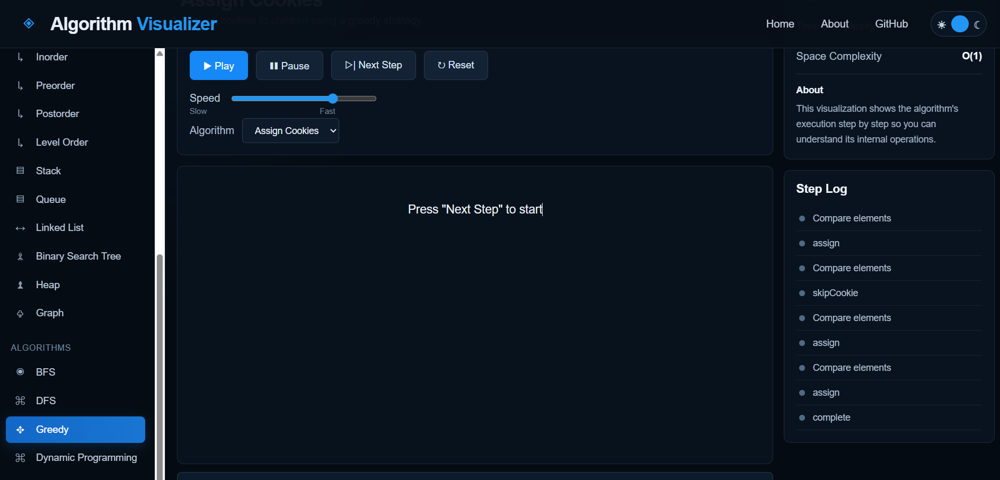
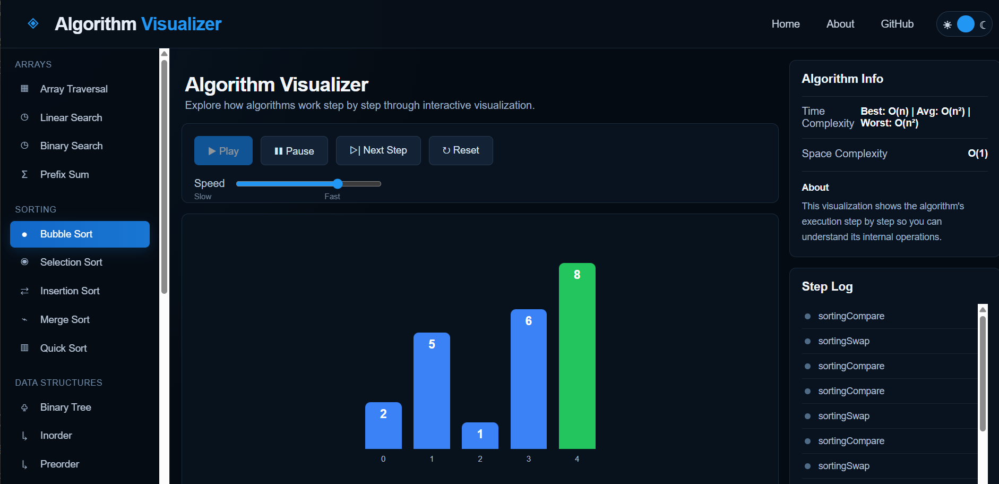
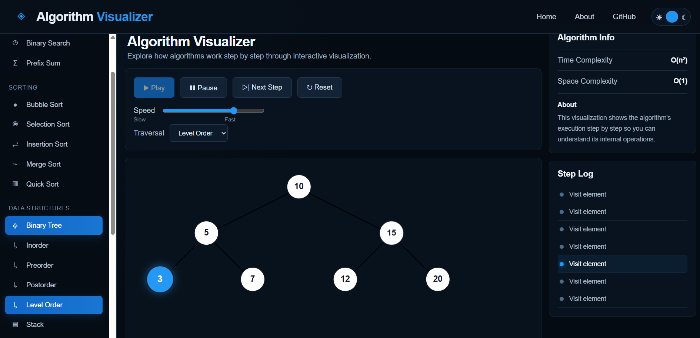
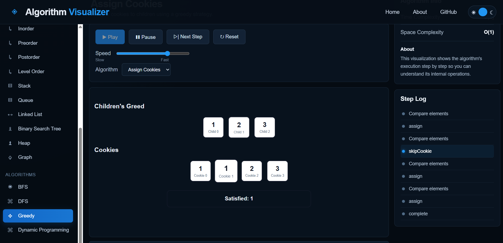

# 🧠 Algorithm Visualizer

An interactive web-based **Algorithm & Data Structure Visualizer** built with React.

This project provides step-by-step visualizations of common algorithms and data structures, making it easier to understand how algorithms work internally through animations, operations, comparisons, swaps, traversal, and state changes.

---

## 🚀 Features

- Step-by-step algorithm execution
- Play / Pause controls
- Adjustable visualization speed
- Reset functionality
- Interactive algorithm selection
- Visual representation of data structures
- Current step tracking
- Operation log
- Algorithm complexity information
- Interactive search targets
- Visual highlighting of comparisons and important operations

---

## 📸 Screenshots

### Dashboard



### Sorting Visualization



### Binary Tree



### Greedy Visualization




# 📚 Algorithms & Data Structures

## 🔎 Searching

### Linear Search

Visualizes sequential searching through an array.

**Complexity**

- Best: `O(1)`
- Average: `O(n)`
- Worst: `O(n)`
- Space: `O(1)`

---

### Binary Search

Visualizes binary search using:

- Low
- Mid
- High
- Found

The search operates on a sorted array.

**Complexity**

- Best: `O(1)`
- Average: `O(log n)`
- Worst: `O(log n)`
- Space: `O(1)`

---

# 📊 Arrays

## Array Traversal

Visualizes sequential traversal of an array and highlights the element currently being visited.

**Complexity**

- Time: `O(n)`
- Space: `O(1)`

---

## Prefix Sum

Builds a prefix-sum array step by step.

Example:

```text
Original:
[1, 2, 3, 4, 5]

Prefix Sum:
[1, 3, 6, 10, 15]

---

## 📁 Project Structure

src/
│
├── algorithms/
│   │
│   ├── arrays/
│   │   └── prefixSum.js
│   │
│   ├── dataStructures/
│   │   ├── bst.js
│   │   ├── stackOperations.js
│   │   ├── queueOperations.js
│   │   ├── linkedListOperations.js
│   │   └── treeOperations.js
│   │
│   ├── dynamicProgramming/
│   │   ├── climbingStairs.js
│   │   ├── houseRobber.js
│   │   ├── coinChange.js
│   │   └── longestIncreasingSubsequence.js
│   │
│   ├── graph/
│   │   ├── Graph.js
│   │   ├── bfs.js
│   │   └── dfs.js
│   │
│   ├── greedy/
│   │   ├── assignCookies.js
│   │   ├── stockProfit.js
│   │   ├── jumpGame.js
│   │   └── jumpGameII.js
│   │
│   ├── heap/
│   │   ├── minHeap.js
│   │   └── maxHeap.js
│   │
│   ├── searching/
│   │   ├── linearSearch.js
│   │   └── binarySearch.js
│   │
│   └── sorting/
│       ├── bubbleSort.js
│       ├── selectionSort.js
│       ├── insertionSort.js
│       ├── mergeSort.js
│       └── quickSort.js
│
├── components/
│   │
│   ├── ArrayTraversalVisualizer/
│   ├── BinarySearchVisualizer/
│   ├── LinkedListVisualizer/
│   ├── QueueVisualizer/
│   ├── StackVisualizer/
│   ├── SortingVisualizer/
│   ├── TreeVisualizer/
│   ├── HeapVisualizer/
│   ├── GraphVisualizer/
│   ├── GreedyVisualizer/
│   ├── DPVisualizer/
│   │
│   ├── Dashboard/
│   └── Layout/
│
├── engine/
│   └── visualizationEngine.js
│
├── App.jsx
└── index.css


## 🖥️ Running Locally

1. Clone the repository

git clone https://github.com/KartikRyzen2006/Algorithm-Visualizer.git

2. Enter the project

cd algorithm-visualizer

3. Install dependencies

npm install

4. Start the development server

npm run dev

The application will then be available through the local Vite development server.

## 🚧 Future Improvements

Potential future improvements include:

More algorithms
More data structures
Binary Search visualization improvements
Interactive array input
Custom array generation
Custom graph creation
Algorithm benchmarking
Performance comparison
Responsive mobile UI
Dark/light theme improvements
Algorithm pseudocode panel
Code execution visualization
More advanced graph algorithms
More advanced dynamic programming algorithms

## 👨‍💻 Author

Kartik Sonar

Computer Science Developer focused on:

Full-Stack Development
Blockchain Development
Data Structures & Algorithms
Web3
React
JavaScript